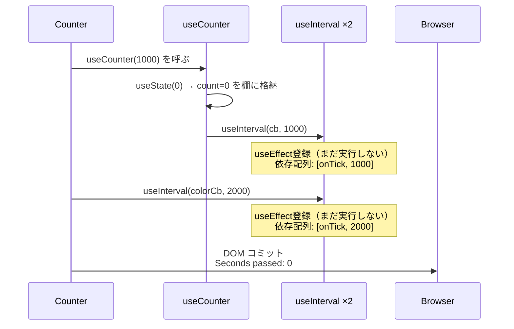
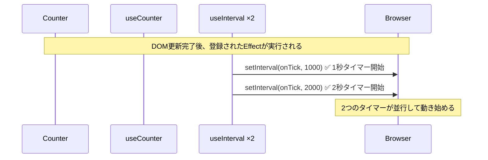
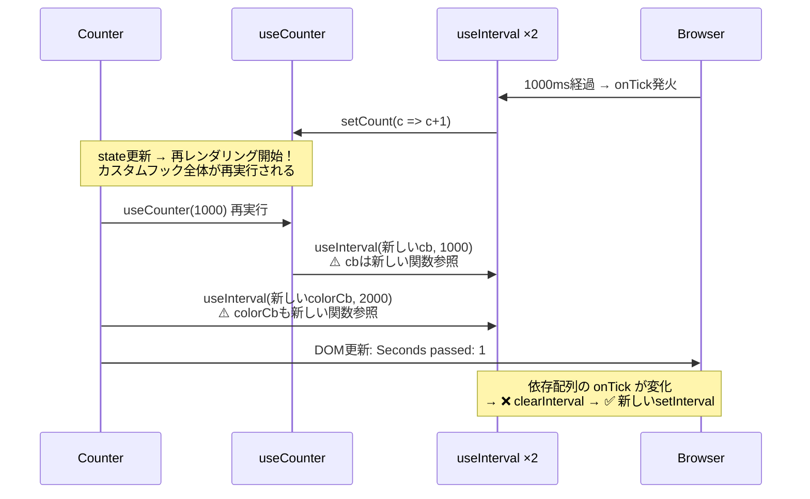

# Reactカスタムフック学習まとめ

## カスタムフック vs Vueコンポーザブル

### 共通点

- 命名規則: どちらも `useXXX`
- 状態＋ロジックをカプセル化して再利用できる
- コンポーネントから切り出して共有可能

### 根本的な違い: 実行タイミング

- **React**: 再レンダリングのたびにカスタムフックの関数本体が**毎回実行される**。ローカル変数は毎回作り直され、`useState` や `useRef` だけが値を保持する。
- **Vue**: コンポーザブルは `setup()` の中で**一度だけ**呼ばれる。`ref()` や `reactive()` がリアクティブなオブジェクトとして生き続ける。

### 対応関係

| Vue (Composition API) | React (Hooks) | 備考 |
|---|---|---|
| `ref()` / `reactive()` | `useState` | |
| `computed()` | `useMemo` | Vueはデフォルトでキャッシュ、Reactは明示的にメモ化 |
| `watch()` / `watchEffect()` | `useEffect` | 目的が異なる（後述） |

### `computed()` vs `useMemo`

```js
// React: デフォルトは毎回再計算
const double = count * 2;

// React: useMemoで明示的にメモ化
const double = useMemo(() => count * 2, [count]);
```

- **Vue `computed()`**: 依存値が変わらなければキャッシュを返す（デフォルト）
- **React `useMemo`**: 開発者が「ここはメモ化が必要」と明示的に判断して使う
- 設計思想: Reactは「デフォルトは毎回再計算、必要なら最適化」/ Vueは「デフォルトでキャッシュ付き」

### `watch` vs `useEffect`

- **Vue `watch`**: 「値Aが変わったら処理Bを実行する」というリアクティブな因果関係がそのまま設計思想
- **React `useEffect`**: 本来の目的は「外部システムとの同期」。依存配列はあくまで同期をいつ再実行するかのヒント
- Vueの感覚で `useEffect` を `watch` のように使うのは罠。Reactではイベントハンドラに書くべきケースが多い

### ReactとVueの設計思想

- **React**: 開発者側で考えることが多い。その分センスが問われてフレームワークとして楽しい。極めたらコントロール感が心地よい
- **Vue**: 誰でも書けてとっつきやすい。難しい部分を隠蔽できていてツールとして優秀。その反面、フレームワークとして面白いという感じはしない

---

## カスタムフックのstateの格納先

カスタムフックは自分自身の棚（Fiber）を持たない。呼び出し元コンポーネントの棚を「間借り」している。

```js
function StatusIndicator() {
  const isOnline = useOnlineStatus();
}
// 内部的にはこう展開されるのとほぼ同じ
function StatusIndicator() {
  const [isOnline, setIsOnline] = useState(true);
  useEffect(() => { /* ... */ }, []);
}
```

### stateの共有について

- **カスタムフックはロジックの共有であり、stateの共有ではない。** 2つのコンポーネントが同じカスタムフックを呼んでも、stateは完全に独立する。
- **Vueのコンポーザブル**ではモジュールスコープに `ref` を置くと暗黙的にstate共有が可能（簡易グローバルstate）
- **React**で複数コンポーネント間のstate共有にはContextを明示的に使う必要がある

```js
// カスタムフック + Context の組み合わせパターン
const OnlineContext = createContext(null);

function OnlineProvider({ children }) {
  const isOnline = useOnlineStatus();
  return (
    <OnlineContext.Provider value={isOnline}>
      {children}
    </OnlineContext.Provider>
  );
}
```

---

## データ取得にuseStateが必要な理由

```js
function useData(url) {
  let data = null; // ❌ ただのローカル変数
  useEffect(() => {
    fetch(url).then(res => res.json()).then(json => { data = json; });
  }, [url]);
  return data; // 常にnullが返る
}
```

ローカル変数への代入はReactから見ると何も起きていないのと同じ。`useState` は2つの役割を果たす:

1. **値を再レンダリングをまたいで保持する**（棚に格納）
2. **`setData` で再レンダリングをトリガーする**（UIに反映）

TanStack Query（旧React Query）のようなライブラリも、内部では `useState` を使っている。抽象化のレイヤーが違うだけで原則は同じ。

---

## shallow copy vs deep copy

- **shallow copy（浅いコピー）**: 一階層目だけコピー。中のオブジェクトは参照共有
- **deep copy（深いコピー）**: ネストも含め再帰的にすべて新規作成。完全独立

```js
const original = [{ name: "Alice" }, { name: "Bob" }];
const shallow = original.slice();

shallow[0].name = "Charlie";
console.log(original[0].name); // "Charlie" ← 元も変わる
```

JavaScriptの組み込みメソッド（`slice()`, `toSorted()` 等）はほぼすべてshallow copy。理由は**パフォーマンス**。deep copyが必要な場合は `structuredClone()` を明示的に使う。「必要なものを必要なだけ」という設計思想はYAGNI原則にも通じる。

---

## useEffectEventの仕組み

### 問題: なぜ依存配列からコールバックを外せるのか

```js
export function useInterval(onTick, delay) {
  const onMessage = useEffectEvent(onTick);
  useEffect(() => {
    const id = setInterval(onMessage, delay);
    return () => clearInterval(id);
  }, [delay]); // onMessageは依存配列に不要
}
```

### 内部の仕組み（概念的な実装）

```js
function useEffectEvent(callback) {
  const ref = useRef(callback);
  ref.current = callback; // 毎レンダリングで最新に差し替え
  return (...args) => ref.current(...args); // この関数の参照は常に同じ
}
```

ポイント:

- `useRef` が返すのは `{ current: value }` というオブジェクト。オブジェクト自体の**参照は常に同じ**
- `ref.current` を毎回上書きしても、それは「Reactから見えない静かな差し替え」
- 返される関数の参照は変わらない → 依存配列に影響しない
- 呼び出し時に `ref.current` を読む → **常に最新のコールバックが実行される**

---

## useIntervalの問題点: 実際の壊れ方

### 問題のあるコード

```js
export function useInterval(onTick, delay) {
  useEffect(() => {
    const id = setInterval(onTick, delay);
    return () => clearInterval(id);
  }, [onTick, delay]); // ⚠️ onTickが依存配列に入っている
}
```

### 動作フロー（シーケンス図）

#### 初回レンダリング



#### Effect実行（マウント後）



#### 1秒後（再レンダリング）



### 壊れ方の分析

**ケース1: 2秒タイマーが1秒タイマーより長い場合**

- 1000msタイマー発火 → `setCount` → 再レンダリング
- 再レンダリングで両方の `onTick` が新しい参照に
- 2000msタイマーも巻き添えでリセット（clearInterval → 新しいsetInterval）
- 2000msタイマーは毎回約1000ms地点でリセットされ、永遠に2000msに到達できない
- **結果: 背景色は一切変わらない**

**ケース2: 背景色タイマーを短くした場合（例: 500ms）**

- 500ms: 背景色タイマー発火 → `document.body.style.backgroundColor` は直接DOM操作なので再レンダリングを起こさない
- 1000ms: 背景色タイマー発火（2回目）＋カウンタータイマー発火
  - `setCount` が呼ばれるが、再レンダリングはバッチ処理で現在のコールバック完了後
  - まだクリーンアップされていないので背景色タイマーは問題なく2回発火できる
- その後、再レンダリング → 両方リセット → サイクル繰り返し
- **結果: 背景色は変わる。カウンターも正常に1秒ごとにインクリメント**

カウンターが正常に動く理由: 再レンダリングを引き起こすのは `setCount` だけで、カウンタータイマーは毎回1000ms完走してから発火→リセットされるため。

### 核心

**再レンダリングを引き起こすかどうか**がすべて。`setState` を使うタイマーがある限り、それより長い間隔のタイマーは壊れる可能性がある。

### 解決策: useEffectEvent

```js
export function useInterval(onTick, delay) {
  const stableOnTick = useEffectEvent(onTick);
  useEffect(() => {
    const id = setInterval(stableOnTick, delay);
    return () => clearInterval(id);
  }, [delay]); // onTickは依存配列から除外できる
}
```

`useEffectEvent` でコールバックの参照を安定させることで、タイマーは `delay` が変わるまで生き続ける。「Effectの同期ロジック（セットアップとクリーンアップ）」と「イベントへの反応（コールバックの中身）」をきれいに分離できる。

---

## 開発原則を学べる書籍

- **『リーダブルコード』**: 読みやすいコードの原則。薄くて読みやすい入門書
- **『プリンシプル オブ プログラミング』**（上田勲）: YAGNI・DRY・KISS・SOLIDなど開発原則をカタログ的にまとめた日本語オリジナル本
- **『達人プログラマー』**（David Thomas & Andrew Hunt）: 原則だけでなく開発者としての姿勢や考え方まで踏み込んだ名著

